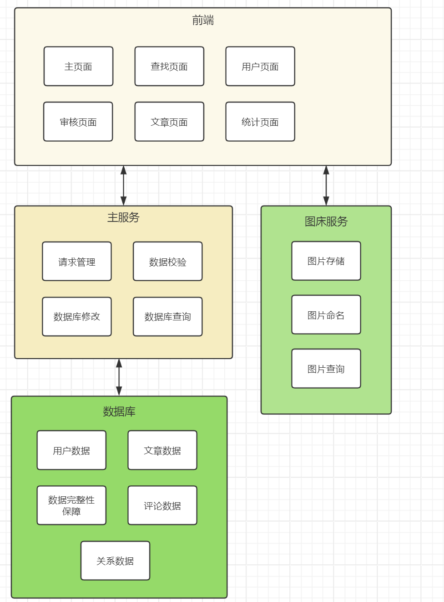
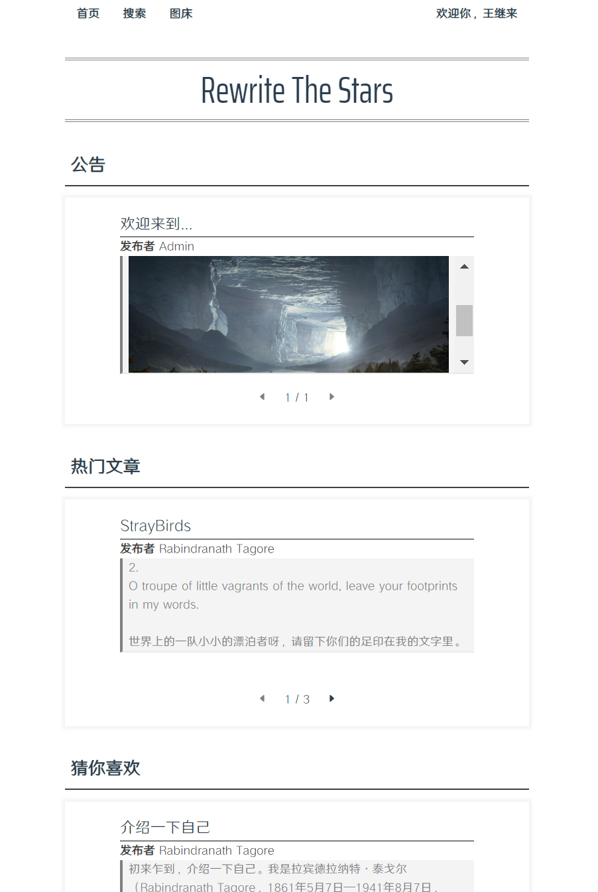
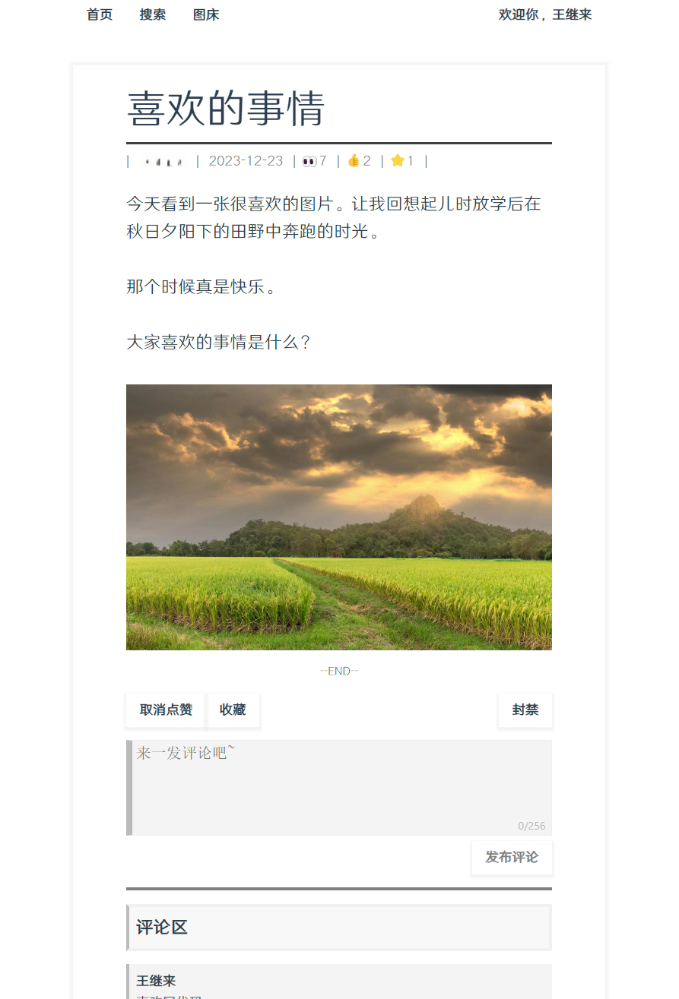
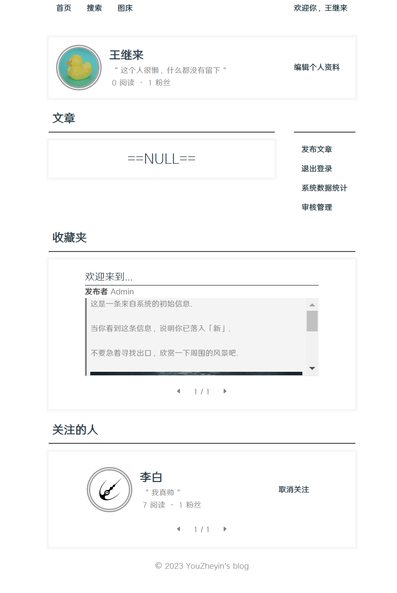
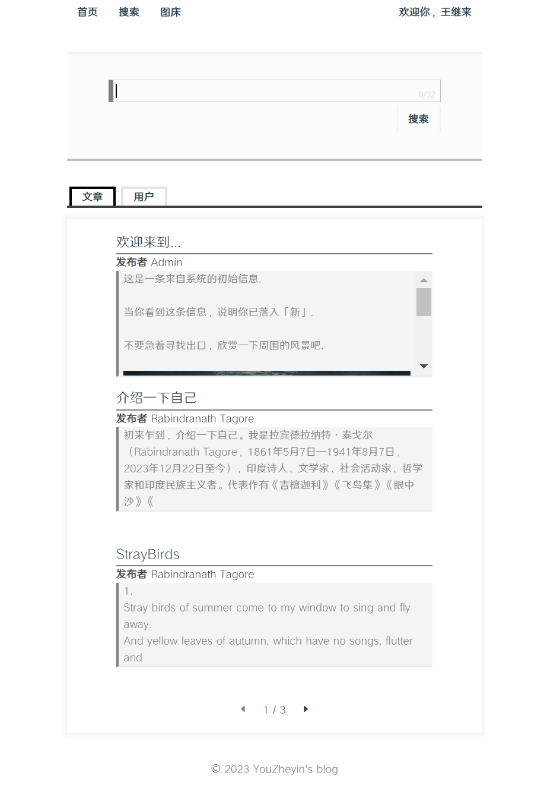
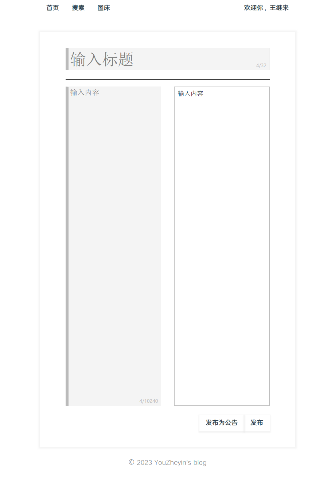
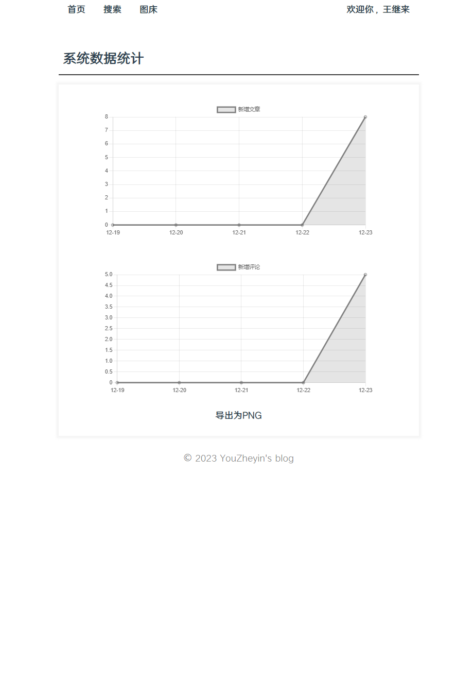
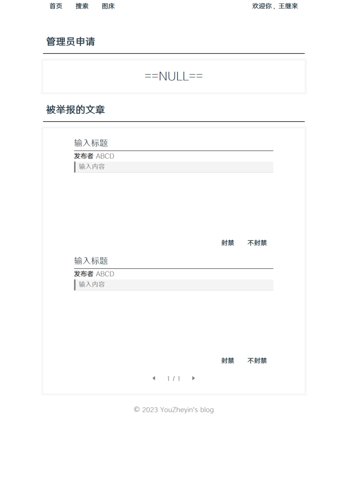

# InkRhythm

本项目为一个简单的文字创作平台，包括用户注册、文章发布、文章阅览、举报与审核等常见功能

实现环境：

* 前端采用 Node.js v20.9.0 + Vue 3.3.4
* 后端分为主服务以及图床服务两部分
	* 主服务采用 Java 1.8 + Spring Boot 2.6.13
	* 图床服务采用 Node.js v20.9.0 + Express 4.18.2
* 数据库使用 MySQL 8.0

## 功能结构图

本项目的项目功能结构图如下：

## 技术和模块

### 前端服务

前端为采用 Vue 实现的单页面应用，其中主要运用的技术为 Vue 响应式布局、axios 异步请求以及前端路由

前端服务可以被拆解为以下模块：

* **通用模块**  包括文字展示、文字编辑、基本交互组件等，能够通过组合形成其他功能模块
* **文章模块**  包括文章头、文章主体、文章评论编辑、以及文章评论区等，负责文章的展示
* **用户模块**  包括用户展示器、用户编辑器、用户主页等，负责用户信息的展示与修改
* **其他组件模块**  包括搜索框、审核页面等组件模块，负责显示相应的内容  
* **路由模块**  将前端地址映射到相应的组件上，实现页面跳转
* **鉴权模块**  保存与用户口令相关的信息，负责发起身份验证请求、缓存或清除用户口令等

### 图床服务

图床服务为采用 Express 实现的简单公共图床

图床服务可以被拆解为以下模块：

* **图片接收及存储**  负责接收前端发送的 base64 编码的图片，将其解码为相应格式，产生唯一的文件名，存储到图床服务器中
* **文件名生成**  根据当前系统时间以及一段随机数产生唯一的文件名
* **图片发送**  负责相应对于图片的请求，返回相应的图片或默认图片

### 主服务

#### 依赖导入和配置资源

导入Spring boot，mybatis-plus，lombok

#### 连接建立数据库

在resources的yml配置文件中配置包括数据库在内的基本信息（如时区，数据库种类，端口等），并在console中用sql语句创建数据库的各个表，相关约束，trigger，procedure

#### 根据数据库设计对应实体

根据设计文档和已经写好的数据库各表内容，创建实体类，类的属性与数据库中对应表的属性一一对应

#### 在controller中与前端需求对接并实现对实体的操作逻辑

根据设计文档的具体需求，为前端的每个请求设计接口，完成规定任务

## 运行实例

主页：

文章页（管理员视角）：

个人页（管理员视角）：

搜索页：

文章发布页：

统计页：

审核页：

---
